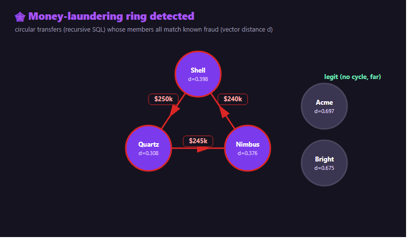
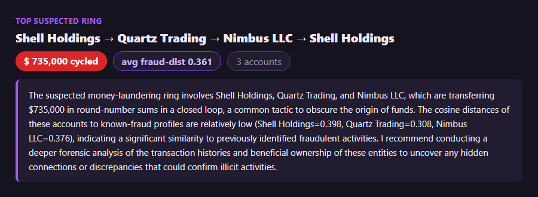

# Catching Money-Laundering Rings with Graph Queries + AI Vector Search on Oracle 26ai

*Two signals, one database: who moves money in circles, and who looks like known fraud.*

---

**📋 At a glance**

- **📦 Repository:** [github.com/khadayatepa/graph-fraud-rings](https://github.com/khadayatepa/graph-fraud-rings)
- **Tech stack:** Oracle 26ai recursive SQL (cycle detection) · AI Vector Search · SQLcl MCP
- **Database:** Oracle AI Database 26ai — 23.26.2.2.0 (Autonomous Database)
- **Prerequisites:** SQLcl 25.2+ (MCP), Python 3.10+, an OpenAI API key
- **Best for:** Detecting fraud rings / circular money flows in transactional data, enriched with vector similarity.
- **Level:** Advanced


A single suspicious transfer rarely proves much. A **ring** — money moving A→B→C→A in round-number hops — is a classic laundering pattern. But one signal alone gives false positives: plenty of legitimate businesses pay each other in loops. So I combine **two** signals in Oracle 26ai: the *structure* (a cycle in the transfer graph) and the *semantics* (do these accounts read like known fraud?).


*The cycle is the structure; the distances are the semantics. Both point at the same three accounts.*

## Signal 1 — find the cycles (recursive SQL)

A recursive query walks the transfer graph and keeps any path that returns to where it started — no special privilege needed:

```sql
WITH paths (start_acct, cur_acct, depth, pth) AS (
  SELECT from_acct, to_acct, 1, '-'||from_acct||'-'||to_acct||'-' FROM transfers
  UNION ALL
  SELECT p.start_acct, t.to_acct, p.depth+1, p.pth||t.to_acct||'-'
  FROM paths p JOIN transfers t ON t.from_acct = p.cur_acct
  WHERE p.depth < 5
    AND (t.to_acct = p.start_acct OR INSTR(p.pth, '-'||t.to_acct||'-') = 0))
SELECT pth FROM paths WHERE cur_acct = start_acct;   -- rows that close the loop
```

> 💡 **The elegant alternative:** Oracle 26ai's **SQL Property Graph** expresses the same thing declaratively — `MATCH (a)->(b)->(c)->(a)`. It needs the `CREATE PROPERTY GRAPH` privilege (`GRANT CREATE PROPERTY GRAPH TO <user>`):
>
> ```sql
> SELECT * FROM GRAPH_TABLE (money
>   MATCH (a)-[]->(b)-[]->(c)-[]->(a)
>   COLUMNS (a.name, b.name, c.name));
> ```

## Signal 2 — confirm with AI Vector Search

Each account has a short profile embedded as a vector. How close is it, by meaning, to profiles of *known* fraud?

```sql
SELECT a.name,
       MIN(VECTOR_DISTANCE(a.embedding, k.embedding, COSINE)) AS fraud_dist
FROM   accounts a, known_fraud k
GROUP  BY a.name
ORDER  BY fraud_dist;     -- ring members ~0.3-0.4, legit businesses ~0.6-0.7
```

The ring members cluster near known fraud; the legitimate businesses sit far away. **Cycle + closeness = a ring worth investigating.**

## The write-up

An LLM turns the finding into an analyst's note with a recommended next step — advisory only, nothing is changed:


*$735k cycled across three fraud-like shells — and a concrete next investigative step.*

## Build it — step by step

1. **Model the money** as `accounts` (with a profile `VECTOR`) and `transfers` (the edges).
2. **Find cycles** with the recursive query (or `GRAPH_TABLE` if you have the privilege).
3. **Score** each account against `known_fraud` profiles with `VECTOR_DISTANCE`.
4. **Rank** rings whose members are fraud-like, and summarise the top one.

```
pip install -r requirements.txt
copy .env.example .env          # OPENAI_API_KEY + ORACLE_MCP_CONNECTION
python src/seed.py              # accounts, transfers, known-fraud profiles (+embeddings)
python src/detect.py            # cycles + vector scoring + LLM summary of the top ring
streamlit run src/dashboard.py  # view detected rings
```

## Why it matters

- **Two weak signals make one strong one.** Structure catches the pattern; vectors cut the false positives — without leaving SQL.
- **No separate graph database.** The relationships, the vectors, and the transactions are all in Oracle 26ai.
- **Read-only and auditable.** The agent only investigates — through the **SQLcl MCP Server**, with a saved connection and an audit trail.

## 🛠️ Do it yourself — step by step (manual SQL)

Find circular money flows by hand — a recursive query needs no special privilege; the property‑graph version needs the graph privilege.

**1) Detect cycles with a recursive query (no special privilege)**

```sql
WITH paths (start_acct, cur_acct, depth, pth) AS (
  SELECT from_acct, to_acct, 1, '-'||from_acct||'-'||to_acct||'-' FROM transfers
  UNION ALL
  SELECT p.start_acct, t.to_acct, p.depth+1, p.pth||t.to_acct||'-'
  FROM paths p JOIN transfers t ON t.from_acct = p.cur_acct
  WHERE p.depth < 5
    AND (t.to_acct = p.start_acct OR INSTR(p.pth, '-'||t.to_acct||'-') = 0))
SELECT pth FROM paths WHERE cur_acct = start_acct;   -- rows that close the loop
```

**2) The same with SQL property graph (if you have the privilege)**

```sql
SELECT * FROM GRAPH_TABLE (money
  MATCH (a)-[]->(b)-[]->(c)-[]->(a)
  COLUMNS (a.name, b.name, c.name));
```

**3) Rank accounts by similarity to known fraud (vector distance)**

```sql
SELECT a.name,
       MIN(VECTOR_DISTANCE(a.embedding, k.embedding, COSINE)) AS fraud_dist
FROM   accounts a, known_fraud k
GROUP  BY a.name ORDER BY fraud_dist;   -- ring members ~0.3-0.4, legit ~0.6-0.7
```


📦 **Full code on GitHub:** [github.com/khadayatepa/graph-fraud-rings](https://github.com/khadayatepa/graph-fraud-rings)

---

*About the author: **Prashant Khadayate** is an **Oracle ACE** focused on the Oracle AI Database (26ai), AI Vector Search, and the SQLcl MCP Server. Connect on [LinkedIn](https://www.linkedin.com/in/prashant-khadayate-1a8b0b97/) for more hands-on Oracle AI experiments.*

> A learning demo on synthetic data — not a real AML system.
